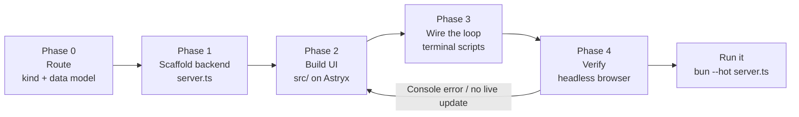

## Contents

| File                            | When to load                                                                                         |
| ------------------------------- | ---------------------------------------------------------------------------------------------------- |
| `references/orchestrator.md`    | Running the pipeline — the five phases, the subagent prompt shape, check-in cadence, stuck detection |
| `references/write-protocol.md`  | Canonical write-protocol block, copied verbatim into every phase worklog and subagent prompt         |
| `references/architecture.md`    | The stack contract — SSE-as-invalidation, the fan-out, `useRegion`, the two-way loop, gotchas        |
| `references/dependencies.md`    | The pinned dependency set, Astryx grounding commands (`bunx astryx component`), the Graphite theme   |
| `references/rendering.md`       | Markdown/mermaid/ECharts patterns, the palette pairing rule, disclosure, overflow guards             |
| `references/recipes.md`         | The recipe catalog — one data model + layout per workbench type, with the unique value of each       |
| `templates/server.ts`           | Backend scaffold — schema, SSE fan-out + `publish()`, region queries, mutation + loop endpoints      |
| `templates/src/`                | Frontend scaffold — `main.tsx`, `App.tsx`, `useRegion.ts`, `charts.ts`, region components            |
| `templates/index.html`          | Fullstack entry Bun.serve imports — the whole "no bundler" trick is this one file                    |
| `templates/package.json`        | The exact-pinned dependency manifest copied into every workbench                                     |
| `templates/graphite-theme/`     | Canonical Graphite theme — `defineTheme` source, built CSS/JS, the `@font-face` fallback             |
| `templates/terminal-helper.ts`  | Zero-dependency bun script the terminal/agent runs to act on shared state and close the loop         |
| `templates/worklog-skeleton.md` | Per-phase worklog with the write-protocol block embedded and a `Status: IN PROGRESS` line            |

# Workbench builder

One skill, one pipeline. Takes a coding/eval/PR/data task → a running localhost workbench through five phases. The heart of the work is Phase 0: deciding what KIND of workbench this is and, more importantly, **what the shared state / data model is**. The data model is the design — everything downstream (regions, components, loop endpoints) falls out of it. Five browser-verified reference implementations ship with the skill: the eval viewer (`${CLAUDE_PLUGIN_ROOT}/skills/workbench-builder/eval-viewer/`), the document-review / redline surface (`${CLAUDE_PLUGIN_ROOT}/skills/workbench-builder/doc-review/`), the multi-PR review room (`${CLAUDE_PLUGIN_ROOT}/skills/workbench-builder/pr-workbench/`), the grid / spreadsheet triage surface (`${CLAUDE_PLUGIN_ROOT}/skills/workbench-builder/grid-workbench/`), and the multi-surface triage queue (`${CLAUDE_PLUGIN_ROOT}/skills/workbench-builder/triage-workbench/`); the templates here are generalized from them.

## Pipeline at a glance

Phase 0 is inline orchestrator work — name the workbench type and write the data model. Phases 1–3 each own one artifact and can run as a general-purpose `Agent` against `references/orchestrator.md`; for a single-surface workbench it is faster to run them inline in sequence. Phase 4 is non-negotiable and runs a real browser, because curl cannot see a guessed component prop, a missing chart registration, or layout overflow. Full runbook with prompts, check-in cadence, and stuck detection lives in `references/orchestrator.md`.

## What to build

The recipe is a different data model + layout over the same stack. Route on the verb the user reached for.

| User signal                                                              | Recipe / scope                                                                       |
| ------------------------------------------------------------------------ | ------------------------------------------------------------------------------------ |
| "eval viewer" / "show me my judge runs" / "pass/fail board"              | Eval viewer — `evals` + `runs` + `events`; outcome badges, run-history chart — BUILT |
| "review this doc" / "let me redline this" / "select text and comment"    | Document review / redline — `annotations`; char-perfect span anchoring — BUILT       |
| "PR review room" / "review these N PRs" / "which order do I merge"       | PR review room — `prs` + `pr_files` + `concerns`; collisions → merge order — BUILT   |
| "spreadsheet" / "data cleanup" / "triage or fix these rows and cells"    | Grid / spreadsheet triage — `rows` + `cells_log`; click-to-edit, actor audit — BUILT |
| "triage my inbox" / "what needs my attention" / "email/Slack/Asana"      | Multi-surface triage — `items` across sources; mark-handled reply detection — BUILT  |
| "trace replay" / "step through this agent run" / "what did the agent do" | Agent trace replay — `steps` timeline + tool-call detail                             |
| "refactor cockpit" / "track this big refactor" / "what's left to touch"  | Refactor cockpit — `targets` + `edits` + progress over modules                       |
| "prompt lab" / "skill lab" / "compare these prompt variants"             | Prompt/skill lab — `variants` + `cases` + `scores`                                   |
| "decision board" / "ADRs" / "log our architecture choices"               | ADR board — `decisions` + `options` + `status`                                       |
| "incident timeline" / "build the postmortem timeline"                    | Incident timeline — `events` ordered, severity lanes                                 |
| "migration planner" / "plan this migration in waves"                     | Migration planner — `items` + `waves` + dependency edges                             |
| "build me a little UI for this <task>"                                   | Route to the closest recipe; if none fits, design a fresh data model                 |

If you cannot name the shared state in one sentence, stop and frame it before scaffolding — see `references/recipes.md`. Run end-to-end with no approval gates when the ask is clear; the whole thing is disposable and bound to `127.0.0.1`, so there is nothing to roll back. Use one `AskUserQuestion` only when the workbench type or the central data model is genuinely ambiguous.

## Write-protocol discipline

Each phase writes its artifact to disk as it goes — one unit of thought → edit the file → next unit. Partial work on disk survives timeouts and context pressure; state held in working memory does not. The canonical block lives in `references/write-protocol.md` and is **copied verbatim** into every phase worklog (`templates/worklog-skeleton.md`) and every subagent prompt — one source of truth, no paraphrasing. The load-bearing artifacts are `server.ts`, the components under `src/`, and the terminal helper(s) under `scripts/`. Nothing else is.

## The stack, and how it composes

Bun.serve + `bun:sqlite` + React 19 + Astryx, bound to `127.0.0.1`, run with `bun --hot server.ts`. Zero build config: `import homepage from "./index.html"` makes Bun transpile TSX/CSS on demand, and `--hot` gives HMR while the UI is reshaped mid-session. One `bun install` against an exact-pinned `package.json` is the only setup. The capability comes from how the pieces compose:

- **SSE is an invalidation signal, not data transport.** A state change emits a tiny NAMED event (`event: <region>\ndata: stale`). One module-level `EventSource` feeds the `useRegion` hook; each named event refetches exactly that region's JSON from `/api/regions/<region>` and React re-renders. A `publish(...regions)` fan-out backs it server-side. The region name must be identical in three places — `publish()`, the wire, `useRegion()` — or the panel silently freezes. (See `references/architecture.md`.)
- **The two-way loop is what makes it a workbench, not a dashboard.** Human acts in the browser; terminal/agent acts via zero-dependency `bun run` scripts; both hit the SAME JSON endpoints over one SQLite file. The human→agent channel — a `requests` table plus `/claude/queue` (pull is claiming) and `/claude/respond` — closes the loop so the human steers and the agent answers, both watching the same state live.
- **Astryx components are queried, never recalled.** Before writing JSX, ground every component's props with `bunx astryx component <Name> --json` (offline, reads the installed manifest). Astryx is beta — a guessed prop renders nothing or throws.

## When NOT to use this skill

- **A production app, an authenticated multi-user service, or a deployed SPA.** Use `frontend-design`. This skill ships a `127.0.0.1`, no-auth, throwaway surface — it is the opposite of production.
- **A static, one-shot data page or a shareable HTML report** with no live updates and no agent loop. A self-contained static HTML file is the right tool when nothing changes after render.
- **A read-only dashboard** where nothing acts back. If there is no human↔agent loop, you do not need SSE or SQLite — a static page is simpler. A workbench earns its stack only when both sides act on shared state.
- **A persistent internal tool.** If it needs auth, deploy, or a real DB, this is a prototype that has outgrown the skill — graduate it.

## Anti-patterns

- **Reaching for Vite, Next, or any bundler config.** Bun's fullstack server already transpiles TSX/CSS on demand; `bun --hot server.ts` is the entire toolchain. Adding a bundler is pure ceremony here.
- **Shipping a read-only dashboard.** A surface that only displays is not a workbench. Close the two-way loop — `requests` table + `/claude/queue` + `/claude/respond` — or you have built the wrong thing.
- **Pushing data over SSE.** SSE carries `event: <region>\ndata: stale`, nothing more. The instant you serialize state into the event payload you have a second source of truth and a client-side state model to keep in sync. Keep events as pure invalidation; let the refetch carry the data.
- **Writing Astryx props from memory.** `Collapsible` takes `trigger` not `label`; `TextArea`'s handler is `changeAction` not `onChange`. Confirm every component against `bunx astryx component <Name>` — the manifest is offline and version-exact.
- **Floating dependency versions.** Astryx is a 0.x beta; a `^` range can pull a breaking release mid-session. Pin exact versions and commit `bun.lock` (see `references/dependencies.md`).
- **Trusting curl-only verification.** curl cannot catch a guessed prop, an unregistered chart type, or a grid overflow. Phase 4 drives a real headless browser and asserts a terminal-side POST updates an already-open page via SSE with ZERO console errors.
- **`networkidle` waits in tests.** Two long-lived connections — the SSE stream and Bun's HMR websocket — keep the network permanently active, so `networkidle` never fires. Navigate with `domcontentloaded`, then wait on a region's `data-testid` selector (React content arrives after hydration + the first fetch).
- **Forgetting `server.timeout(req, 0)` on `/events`.** Bun idle-times-out the SSE stream without it, and the page reconnect-storms.
- **Opening a `Database` per request.** `bun:sqlite` is synchronous and the server is one process — one module-level connection, WAL on, is the whole data layer.
- **Rendering self-measuring content into hidden boxes.** Mermaid and ECharts measure their container; a closed Collapsible or Dialog yields 0×0 output. Mount that content only while the disclosure is open.
- **CSS grid overflow on wide artifacts.** Grid items default to `min-width:auto` and refuse to shrink below their content. Put `min-width:0` on every column that renders markdown, tables, or diagrams.
