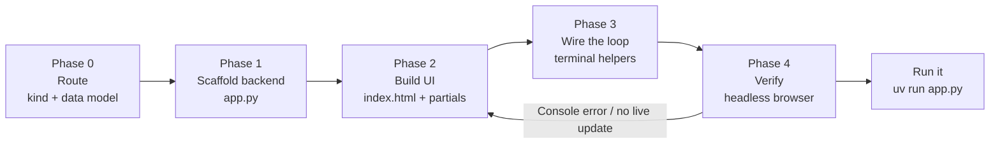

## Contents

| File                            | When to load                                                                                            |
| ------------------------------- | ------------------------------------------------------------------------------------------------------- |
| `references/orchestrator.md`    | Running the pipeline — the five phases, the subagent prompt shape, check-in cadence, stuck detection    |
| `references/write-protocol.md`  | Canonical write-protocol block, copied verbatim into every phase worklog and subagent prompt            |
| `references/architecture.md`    | The boring-on-purpose stack — SSE-as-invalidation, the fan-out, the two-way loop, threading, gotchas    |
| `references/cdn-deps.md`        | Verified CDN dependency catalog — SRI hashes, the uncompressed-bytes rule, package-name traps           |
| `references/rendering.md`       | The markdown/mermaid/highlight/sanitize pipeline, progressive disclosure (chip → modal/sheet), charts   |
| `references/recipes.md`         | The recipe catalog — one data model + layout per workbench type, with the unique value of each          |
| `templates/app.py`              | Backend scaffold — SQLite schema, db helpers, SSE fan-out + `publish()`, partial routes, loop endpoints |
| `templates/index.html`          | Frontend scaffold — CDN tags with verified SRI, design tokens, htmx-SSE wiring, render engine, overlays |
| `templates/terminal-helper.py`  | PEP 723 httpx helper the terminal/agent runs to act on shared state and close the loop                  |
| `templates/worklog-skeleton.md` | Per-phase worklog with the write-protocol block embedded and a `Status: IN PROGRESS` line               |

# Workbench builder

One skill, one pipeline. Takes a coding/eval/PR/data task → a running localhost workbench through five phases. The heart of the work is Phase 0: deciding what KIND of workbench this is and, more importantly, **what the shared state / data model is**. The data model is the design — everything downstream (partials, SSE targets, loop endpoints) falls out of it. The reference implementations are the eval viewer at `${CLAUDE_PLUGIN_ROOT}/skills/workbench-builder/workbench/`, the PR review room at `${CLAUDE_PLUGIN_ROOT}/skills/workbench-builder/pr-workbench/`, and the document-review / redline surface at `${CLAUDE_PLUGIN_ROOT}/skills/workbench-builder/doc-review/`; the templates here are generalized from them.

## Pipeline at a glance

Phase 0 is inline orchestrator work — name the workbench type and write the data model. Phases 1–3 each own one artifact and can run as a general-purpose `Agent` against `references/orchestrator.md`; for a single-surface workbench it is faster to run them inline in sequence. Phase 4 is non-negotiable and runs a real browser, because curl cannot see SRI mismatches, missing JS globals, or layout overflow. Full runbook with prompts, check-in cadence, and stuck detection lives in `references/orchestrator.md`.

## What to build

The recipe is a different data model + layout over the same stack. Route on the verb the user reached for.

| User signal                                                              | Recipe / scope                                                                          |
| ------------------------------------------------------------------------ | --------------------------------------------------------------------------------------- |
| "eval viewer" / "show me my judge runs" / "pass/fail board"              | Eval viewer — `evals` + `runs` + `events`; status pills, history chart                  |
| "PR review room" / "review these N PRs" / "which order do I merge"       | PR review room — `prs` + `pr_files` + `concerns` + `requests`; collisions → merge order |
| "review this doc" / "let me redline this" / "select text and comment"    | Document review / redline — `annotations`; char-perfect span anchoring, agent resolves  |
| "trace replay" / "step through this agent run" / "what did the agent do" | Agent trace replay — `steps` timeline + tool-call detail sheet                          |
| "refactor cockpit" / "track this big refactor" / "what's left to touch"  | Refactor cockpit — `targets` + `edits` + progress over modules                          |
| "data cleanup" / "let me triage these rows" / "fix these records"        | Data-cleanup surface — `rows` + `decisions`; keep/fix/drop per row                      |
| "prompt lab" / "skill lab" / "compare these prompt variants"             | Prompt/skill lab — `variants` + `cases` + `scores`                                      |
| "decision board" / "ADRs" / "log our architecture choices"               | ADR board — `decisions` + `options` + `status`                                          |
| "incident timeline" / "build the postmortem timeline"                    | Incident timeline — `events` ordered, severity lanes                                    |
| "migration planner" / "plan this migration in waves"                     | Migration planner — `items` + `waves` + dependency edges                                |
| "build me a little UI for this <task>"                                   | Route to the closest recipe; if none fits, design a fresh data model                    |

If you cannot name the shared state in one sentence, stop and frame it before scaffolding — see `references/recipes.md`. Run end-to-end with no approval gates when the ask is clear; the whole thing is disposable and bound to `127.0.0.1`, so there is nothing to roll back. Use one `AskUserQuestion` only when the workbench type or the central data model is genuinely ambiguous.

## Write-protocol discipline

Each phase writes its artifact to disk as it goes — one unit of thought → edit the file → next unit. Partial work on disk survives timeouts and context pressure; state held in working memory does not. The canonical block lives in `references/write-protocol.md` and is **copied verbatim** into every phase worklog (`templates/worklog-skeleton.md`) and every subagent prompt — one source of truth, no paraphrasing. The load-bearing artifacts are `app.py`, `templates/index.html`, the per-region partials under `templates/partials/`, and the terminal helper(s) under `scripts/`. Nothing else is.

## The stack, and why it's boring on purpose

Flask + raw `sqlite3` (no ORM) + Jinja partials, bound to `127.0.0.1`, with `app.run(host="127.0.0.1", port=..., debug=True, threaded=True)`. `threaded=True` keeps the long-lived SSE stream from blocking other requests; `debug=True` gives hot reload while you reshape the UI mid-session. "Boring" means no toolchain — no npm, no bundler, no build step, no deploy — **not** no capability. The capability comes from how the pieces compose:

- **SSE is an invalidation signal, not data transport.** A state change emits a tiny NAMED event (`event: <region>\ndata: stale`). The browser opens ONE `EventSource` via the htmx SSE extension on `<body>` (`hx-ext="sse" sse-connect="/events"`); each live region carries `hx-trigger="sse:<region>"` + `hx-get="/partials/<region>"`, so a named event re-fetches exactly that one server-rendered partial over a normal GET. A fan-out of subscriber queues backs `publish(*targets)`. No payload, no client state model. (See `workbench/app.py` `publish()`/`/events` and `index.html`.)
- **The two-way loop is what makes it a workbench, not a dashboard.** Human acts in the browser; terminal/agent acts via httpx; both share one SQLite file. The human→agent channel — a `requests` table plus `/claude/queue` (pull) and `/claude/respond` (answer) — closes the loop so the human steers and the agent answers, both watching the same state live. (See `pr-workbench/app.py` and `scripts/review_loop.py`.)
- **Terminal helpers are PEP 723 inline-dep scripts** (`# /// script` … `dependencies = ["httpx"]`) run with `uv run`.

CDN libraries load with verified Subresource Integrity hashes. Hash the **uncompressed** bytes (`curl -sL -H "Accept-Encoding: identity" … | openssl dgst -sha384 -binary | openssl base64 -A`) because the browser hashes the decompressed file — see `references/cdn-deps.md` for the full catalog and the package-name traps (highlight.js browser build, non-min marked-highlight, d3-before-Plot).

## When NOT to use this skill

- **A production app, an authenticated multi-user service, or a React/Vue/Svelte SPA.** Use `frontend-design`. This skill ships a `127.0.0.1`, no-auth, throwaway surface — it is the opposite of production.
- **A static, one-shot data page or a shareable HTML report** with no live updates and no agent loop. Use `generative-ui` — a self-contained file is the right tool when nothing changes after render.
- **A read-only dashboard** where nothing acts back. If there is no human↔agent loop, you do not need SSE or SQLite — a static page is simpler. A workbench earns its stack only when both sides act on shared state.
- **A persistent internal tool.** If it needs auth, deploy, or a real DB, this is a prototype that has outgrown the skill — graduate it.

## Anti-patterns

- **Reaching for React, npm, a bundler, or a build step.** The entire value proposition is zero toolchain. The moment you `npm install`, you have left the skill. htmx + server-rendered partials cover the interactivity a workbench needs.
- **Shipping a read-only dashboard.** A surface that only displays is not a workbench. Close the two-way loop — `requests` table + `/claude/queue` + `/claude/respond` — or you have built the wrong thing.
- **Pushing data over SSE.** SSE carries `event: <region>\ndata: stale`, nothing more. The instant you serialize state into the event payload you have a second source of truth and a client-side state model to keep in sync. Keep events as pure invalidation; let the GET re-render the partial.
- **Trusting curl-only verification.** curl cannot catch an SRI mismatch, a missing JS global (`require is not defined`), or a CSS grid overflow. Phase 4 drives a real headless browser (Chrome via Playwright, `domcontentloaded` — never `networkidle`, since the open SSE stream keeps the network forever active) and asserts a terminal-side POST updates an already-open browser via SSE with ZERO console errors.
- **Recomputing the verified SRI hashes casually.** The catalog in `references/cdn-deps.md` was hashed over uncompressed bytes and confirmed in-browser. If you re-hash, you MUST use `Accept-Encoding: identity`, or the browser will block the script on an integrity mismatch. Do not paste a hash from a curl that let jsDelivr compress the response.
- **Forgetting `threaded=True`.** A single-threaded Flask blocks every other request behind the long-lived SSE generator. The whole UI freezes. It is one keyword; do not drop it.
- **CSS grid overflow on wide artifacts.** Grid items default to `min-width:auto` and refuse to shrink below their content, so wide tables and mermaid diagrams escape the panel. Add `min-width:0` + `overflow-wrap:anywhere` on the column and the `.md` cell. (Pills are the exception — use `white-space:nowrap` in a scrollable container, not `overflow-wrap`, which stacks letters vertically.)
- **Re-rendering markdown only on first load.** SSE-swapped fragments arrive after page load, so re-run the whole marked → highlight → mermaid → DOMPurify pipeline on `htmx:afterSwap`, and run `mermaid.run({nodes})` only after the HTML lands and after sanitizing with `{ADD_TAGS:['pre'], ADD_ATTR:['class']}`. (See `index.html` `htmx:afterSwap` handler.)
